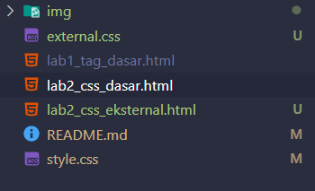
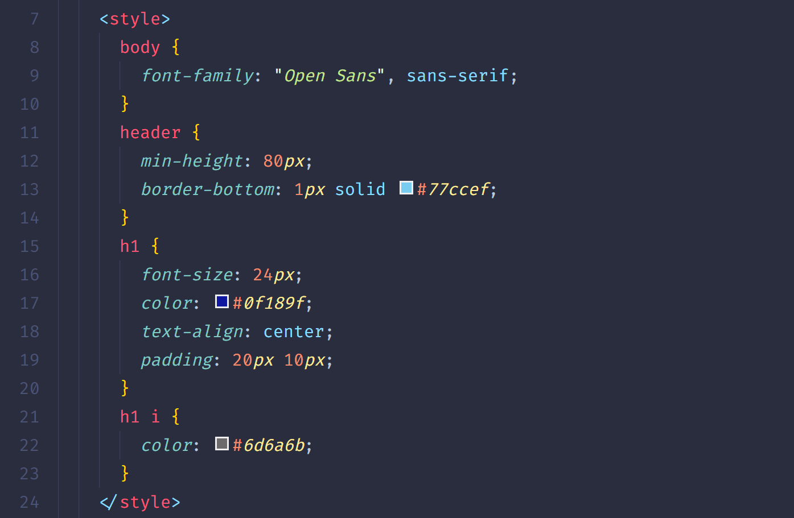
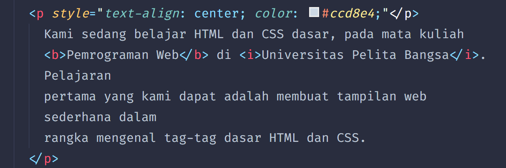
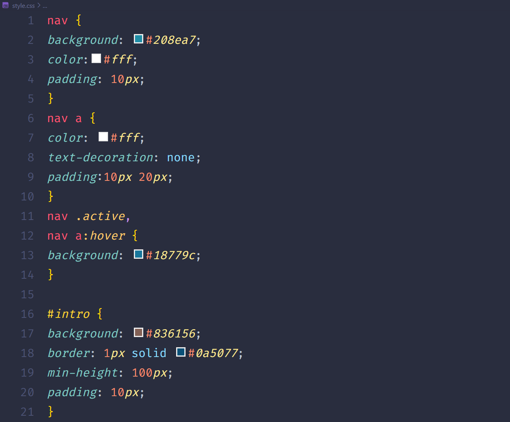

```markdown
# Praktikum 2 – CSS Dasar  

Repository ini berisi hasil praktikum **Pemrograman Web** – *Praktikum 2 CSS Dasar* di Universitas Pelita Bangsa.  

Nama: Arfianda Firsta Satritama
NIM:312410377

---
```

## 📂 Struktur Repository  

```
Lab2Web/
│
├── lab2_css_dasar.html
├── lab2_css_eksternal.html
├── style_eksternal.css
└── README.md
````

---

## 🚀 Langkah-langkah Praktikum  

### 1️⃣ Membuat Dokumen HTML  
Buat file baru bernama **`lab2_css_dasar.html`** dengan struktur dasar:  

```html
<!DOCTYPE html>
<html lang="en">
<head>
    <meta charset="UTF-8">
    <meta name="viewport" content="width=device-width, initial-scale=1.0">
    <title>CSS Dasar</title>
</head>
<body>
    <header>
        <h1>CSS Internal dan <i>Inline CSS</i></h1>
    </header>
    <nav>
        <a href="lab2_css_dasar.html">CSS Dasar</a>
        <a href="lab2_css_eksternal.html">CSS Eksternal</a>
        <a href="lab1_tag_dasar.html">HTML Dasar</a>
    </nav>
    <div id="intro">
        <h1>Hello World</h1>
        <p>Kami sedang belajar HTML dan CSS dasar...</p>
        <a class="button btn-primary" href="#intro">Informasi selengkapnya.</a>
    </div>
</body>
</html>
````

📸 


---

### 2️⃣ Mendeklarasikan CSS Internal

Tambahkan CSS **internal** pada bagian `<head>`:

```html
<style>
    body {
        font-family: 'Open Sans', sans-serif;
    }
    header {
        min-height: 80px;
        border-bottom: 1px solid #77CCEF;
    }
    h1 {
        font-size: 24px;
        color: #0F189F;
        text-align: center;
        padding: 20px 10px;
    }
    h1 i {
        color: #6d6a6b;
    }
</style>
```

---

### 3️⃣ Menambahkan Inline CSS

Tambahkan CSS **inline** :

```html
<p style="text-align: center; color: #ccd8e4;">
    Paragraf ini menggunakan inline CSS
</p>
```

---

### 4️⃣ Membuat CSS Eksternal

Buat file **`style.css`** lalu tambahkan kode:

```css
nav {
    background: #20A759;
    color: #fff;
    padding: 10px;
}
nav a {
    color: #fff;
    text-decoration: none;
    padding: 10px 20px;
}
nav .active, nav a:hover {
    background: #0B6B3A;
}
```

Kemudian hubungkan dengan HTML:

```html
<head>
  <link rel="stylesheet" href="style.css" type="text/css">
</head>
```


---

### 5️⃣ Menambahkan CSS Selector (ID dan Class)

Tambahkan kode berikut di **`style.css`**:

```css
/* ID Selector */
#intro {
    background: #418fb1;
    border: 1px solid #099249;
    min-height: 100px;
    padding: 10px;
}
#intro h1 {
    text-align: left;
    color: #fff;
}

/* Class Selector */
.button {
    padding: 15px 20px;
    background: #bebcbd;
    color: #fff;
    display: inline-block;
    margin: 10px;
    text-decoration: none;
}
.btn-primary {
    background: #E42A42;
}
```

---

## 📚 Pertanyaan Praktikum

1. Lakukan eksperimen dengan menambah properti CSS berdasarkan CSS Cheat Sheet.

Misalnya menambahkan properti background-color, font-size, dan border-radius:

```
p {
  background-color: #f2f2f2;
  font-size: 14pt;
  border-radius: 10px;
  padding: 10px;
}
```

Hasilnya paragraf memiliki background abu-abu, ukuran font lebih besar, dan sudut melengkung.

2. Apa perbedaan deklarasi `h1 {...}` dengan `#intro h1 {...}`?
```
h1 {...} → berlaku untuk semua elemen <h1> pada halaman.

#intro h1 {...} → hanya berlaku untuk elemen <h1> yang berada di dalam elemen dengan id="intro".
```

```
<h1>Judul Umum</h1> <!-- akan kena CSS h1 {...} -->
<div id="intro">
  <h1>Judul Intro</h1> <!-- akan kena CSS #intro h1 {...} -->
</div>
```
```
#intro h1 lebih spesifik dibanding h1 saja.
```

3. Jika ada CSS internal, eksternal, dan inline pada elemen yang sama, manakah yang ditampilkan? Jelaskan.

Urutan prioritas (specificity & cascade):

Inline CSS → paling tinggi prioritas.

Internal CSS → prioritas menengah.

Eksternal CSS → prioritas lebih rendah.


4. Jika sebuah elemen punya ID dan Class dengan deklarasi berbeda, manakah yang ditampilkan browser? Contoh:

   ```html
   <p id="paragraf-1" class="text-paragraf">...</p>
   ```

 teks akan merah, karena CSS ID (#paragraf-1) mengalahkan class (.text-paragraf).

---


## 📸 Dokumentasi

| Langkah       | Screenshot                                  |
| ------------- | ------------------------------------------- |
| Dokumen HTML  |              |
| CSS Internal  |  |
| Inline CSS    |      |
| CSS Eksternal |    |

---
